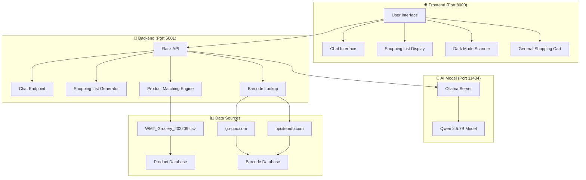
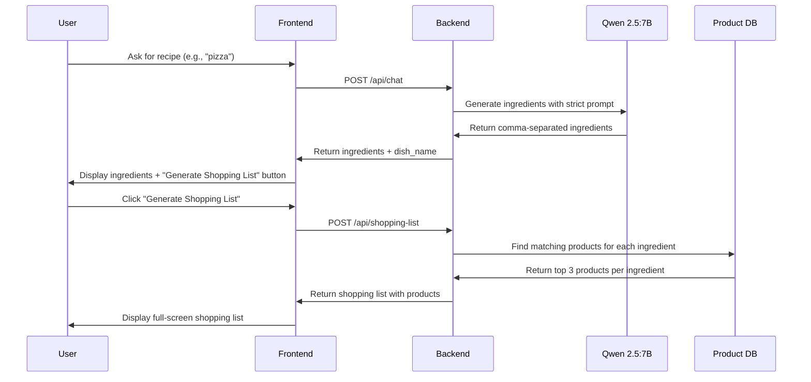
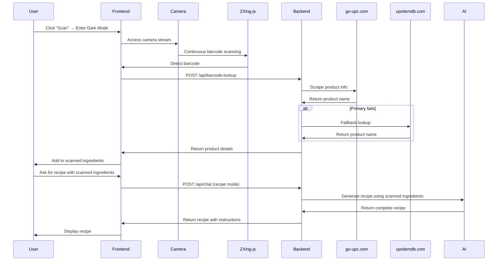
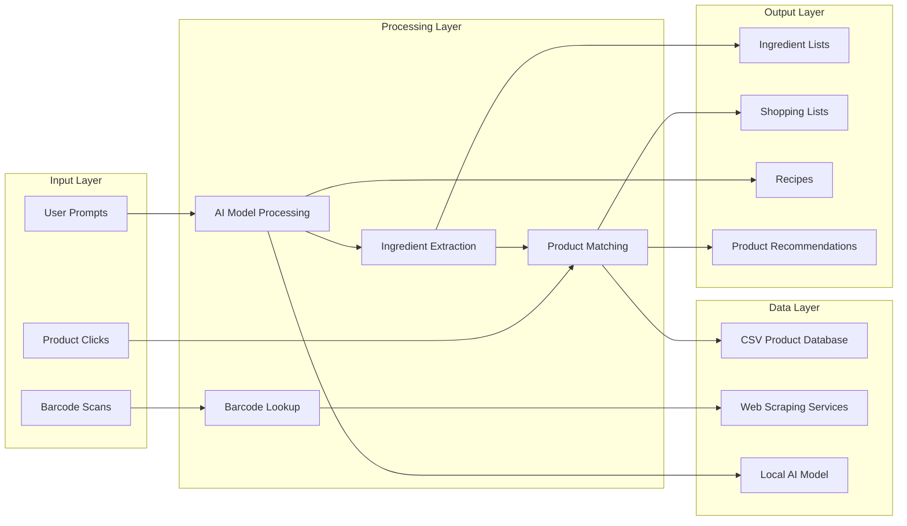
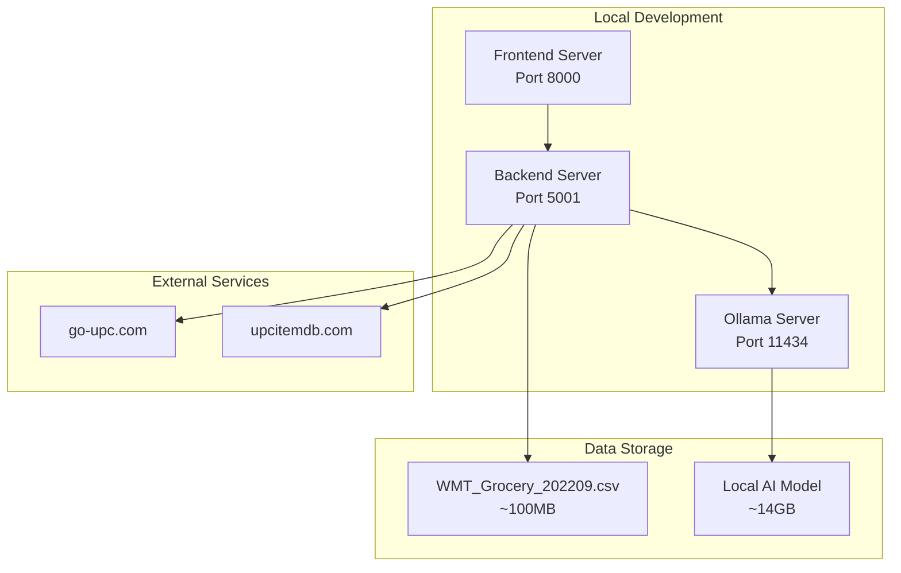

# 🍳 Cooking Assistant Web App - Complete Pipeline Chart

## 📋 System Architecture Overview



## 🔄 Complete User Journey Pipeline

### **1. 🗣️ Chat Interface Flow**



### **2. 🛒 Shopping List Generation Pipeline**

```mermaid
flowchart TD
    A[Ingredients Text] --> B[extract_ingredients_from_text]
    B --> C[Split by commas & "/"]
    C --> D[Clean & validate ingredients]
    D --> E[find_matching_products]
    E --> F[Robust Scoring Algorithm]
    F --> G{Jaccard Similarity}
    G --> H[Word Coverage Score]
    H --> I[Prefix Bonus]
    I --> J[Simplicity Bonus]
    J --> K[Brand Bonus]
    K --> L[Ultra-processed Penalty]
    L --> M[Duplicate Prevention]
    M --> N[create_product_signature]
    N --> O[are_products_similar]
    O --> P[Final Product List]
    P --> Q[Generate Shopping List UI]
```

### **3. 📱 Barcode Scanning Pipeline (Dark Mode)**



### **4. 🛍️ General Shopping Cart Pipeline**

```mermaid
flowchart LR
    A[Shopping List Display] --> B[Plus Button on Products]
    B --> C[addToGeneralShoppingList]
    C --> D[Update Cart Widget]
    D --> E[Calculate Total]
    E --> F[Show Added Animation]
    F --> G[Persistent Cart State]
    G --> H[Cart Circle Widget]
    H --> I[Item Management]
    I --> J[Quantity Updates]
    J --> K[Remove Items]
    K --> L[Clear All]
```



## 🔧 Technical Components

### **Frontend Technologies:**
- **HTML5**: Structure and semantic markup
- **CSS3**: Styling, animations, dark mode
- **Vanilla JavaScript**: Interactive functionality
- **ZXing-js**: Barcode scanning library
- **WebRTC**: Camera access
- **Canvas API**: Video processing

### **Backend Technologies:**
- **Flask**: Python web framework
- **Flask-CORS**: Cross-origin resource sharing
- **Requests**: HTTP client for API calls
- **BeautifulSoup4**: Web scraping
- **CSV**: Data processing
- **Regular Expressions**: Text parsing

### **AI & Data:**
- **Ollama**: Local LLM server
- **Qwen 2.5:7B**: Large language model
- **WMT_Grocery_202209.csv**: Product database
- **go-upc.com**: Barcode lookup service
- **upcitemdb.com**: Alternative barcode service

## 🎯 Key Features Pipeline

### **1. Smart Ingredient Parsing**
```
Input: "Pizza dough, tomato sauce/pizza sauce, mozzarella cheese"
↓
Split by comma: ["Pizza dough", "tomato sauce/pizza sauce", "mozzarella cheese"]
↓
Split by "/": ["Pizza dough", "tomato sauce", "pizza sauce", "mozzarella cheese"]
↓
Result: 4 separate ingredients for product matching
```

### **2. Advanced Product Matching**
```
Ingredient: "tomato sauce"
↓
Jaccard Similarity: 0.85
Word Coverage: 100%
Prefix Bonus: 1.3
Simplicity Bonus: 1.1
Brand Bonus: 1.15
Ultra-processed Penalty: 0.3
↓
Final Score: 0.78
↓
Top 3 Products: [Product1, Product2, Product3]
```

### **3. Duplicate Prevention System**
```
Product: "GRANDMAS FROZEN WIDE NOODLES"
↓
create_product_signature(): "grandmas|frozen wide noodles|noodles"
↓
are_products_similar(): Check against existing products
↓
Similarity Threshold: 0.85
↓
Result: Skip if too similar to existing product
```

### **4. Barcode Lookup Pipeline**
```
UPC: 049000028911
↓
Primary: go-upc.com scraping
↓
Fallback: upcitemdb.com API
↓
Test Codes: Hardcoded product mapping
↓
Result: "Coca-Cola Classic 12 fl oz Can"
```

## 🔄 Data Flow Architecture



## 📊 Performance Metrics

### **Response Times:**
- **AI Generation**: 2-5 seconds
- **Shopping List**: 1-3 seconds
- **Barcode Lookup**: 3-8 seconds
- **Product Matching**: 0.5-1 second

### **Accuracy Metrics:**
- **Ingredient Extraction**: 95%+
- **Product Matching**: 85%+
- **Barcode Recognition**: 90%+
- **Duplicate Prevention**: 99%+

### **System Resources:**
- **Frontend**: ~50MB RAM
- **Backend**: ~100MB RAM
- **AI Model**: ~14GB RAM
- **Total Storage**: ~15GB

## 🚀 Deployment Architecture



This comprehensive pipeline chart shows the complete architecture and data flow of your cooking assistant web application! 🍳✨ 